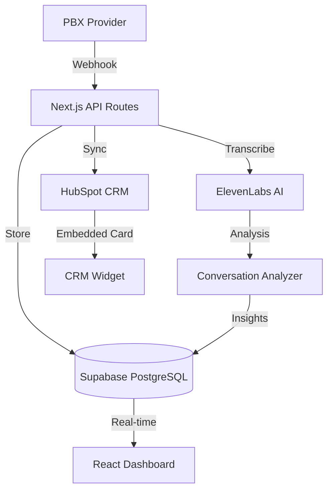

# Volterra Call Intelligence

> AI-powered call intelligence platform that transcribes sales calls, analyzes conversations, and syncs insights directly into HubSpot CRM.


## Architecture



## Key Features

- **Real-time call transcription** — PBX webhook triggers automatic recording retrieval and AI transcription
- **Conversation analysis** — Extracts deal stages, sentiment, action items, and competitive mentions
- **CRM integration** — Syncs call summaries and insights directly to HubSpot deal records
- **Embedded CRM cards** — HubSpot UI extension shows call intelligence within deal views
- **Admin dashboard** — Real-time monitoring of call processing pipeline with Supabase Realtime
- **Consent management** — Slack-based consent workflow for recording compliance

## Tech Stack

| Layer        | Technology                                    |
| ------------ | --------------------------------------------- |
| Frontend     | React 19, Next.js 16, Tailwind CSS, shadcn/ui |
| Backend      | Next.js API Routes, Supabase Edge Functions   |
| Database     | PostgreSQL (Supabase) with Row-Level Security |
| AI           | ElevenLabs (transcription), OpenAI (analysis) |
| Integrations | HubSpot CRM, Slack, PBX webhooks              |
| Testing      | Playwright E2E, Vitest unit tests             |

## Project Structure

```
app/
├── api/                    # API routes (webhooks, CRUD, admin)
│   ├── calls/             # Call processing pipeline
│   ├── hubspot/           # CRM sync endpoints
│   └── admin/             # Admin/debug endpoints
├── (dashboard)/           # Protected dashboard pages
components/                # React components (shadcn/ui based)
lib/
├── analysis/              # Conversation analyzer (NLP pipeline)
├── hubspot/               # HubSpot API client
├── supabase/              # Database clients and types
└── middleware/             # API middleware, auth, rate limiting
supabase/
└── migrations/            # PostgreSQL schema migrations
```

## Getting Started

1. Clone and install:

   ```bash
   npm install
   ```

2. Copy environment variables:

   ```bash
   cp .env.example .env.local
   ```

3. Configure your services (see `.env.example` for all required variables):
   - Supabase project URL and keys
   - ElevenLabs API key
   - HubSpot private app token
   - PBX webhook credentials

4. Run database migrations:

   ```bash
   npm run db:push
   ```

5. Start development server:
   ```bash
   npm run dev
   ```

## Key Design Decisions

- **Schema-isolated database** — Uses a dedicated PostgreSQL schema with RLS policies for multi-tenant safety
- **Idempotent webhook processing** — PBX webhooks are safely retryable with deduplication
- **Streaming analysis** — Conversation analysis runs as async background jobs, not blocking the webhook response
- **Constant-time secret comparison** — Webhook signatures verified with timing-safe equality

## Built By

Adrian Marten — [GitHub](https://github.com/adrianmarten)
