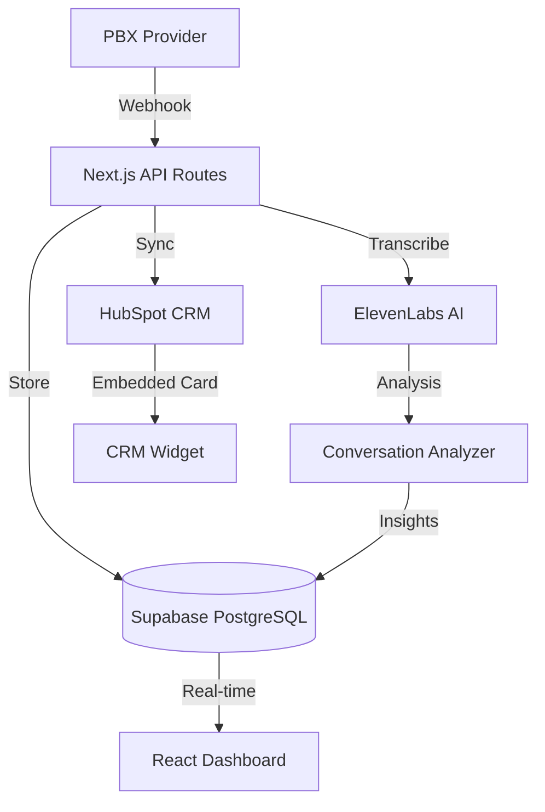

# Volterra Call Intelligence

> Sales reps were losing deal context from calls -- no systematic capture, no structured analysis, managers blind to pipeline health beyond manual CRM logs. This platform auto-transcribes every call and extracts actionable signals directly into HubSpot.


## The Problem

In a high-velocity B2B sales cycle, reps made dozens of calls daily with no systematic capture. Deal context lived in reps' heads or scattered CRM notes. Managers had no visibility into pipeline health beyond what reps manually logged -- no way to spot deals going cold, competitive threats surfacing, or coaching opportunities.

## What This Does

- **Automatic transcription** -- PBX webhooks trigger recording retrieval and AI transcription via ElevenLabs, with no manual steps
- **NLP analysis (5 signal types)** -- Extracts deal stage indicators, sentiment shifts, action items, competitive mentions, and objection patterns from every conversation
- **CRM sync with embedded cards** -- Pushes structured insights to HubSpot deal records; custom CRM card surfaces call intelligence directly in the rep's workflow

## Impact

| Metric              | Detail                                                   |
| ------------------- | -------------------------------------------------------- |
| Manual call logging | Eliminated -- every call auto-transcribed and analyzed   |
| Signal extraction   | 5 structured signal types from each conversation         |
| Pipeline visibility | Real-time dashboard with Supabase Realtime subscriptions |
| Compliance          | Slack-based consent workflow for recording authorization |

## Part of the Volterra Platform

Call Intelligence feeds conversation data into the [Knowledge Engine](../volterra-knowledge-engine/) for cross-system search, and leverages deal context from the [Semantic Platform](../volterra-semantic-platform/) to enrich analysis.

## Architecture


```mermaid
graph TB
    PBX[PBX Provider] -->|Webhook| API[Next.js API Routes]
    API -->|Store| DB[(Supabase PostgreSQL)]
    API -->|Transcribe| AI[ElevenLabs AI]
    AI -->|Analysis| Analyzer[Conversation Analyzer]
    Analyzer -->|Insights| DB
    DB -->|Real-time| Dashboard[React Dashboard]
    API -->|Sync| CRM[HubSpot CRM]
    CRM -->|Embedded Card| Card[CRM Widget]
```

## Key Features

- **Real-time call transcription** — PBX webhook triggers automatic recording retrieval and AI transcription
- **Conversation analysis** — Extracts deal stages, sentiment, action items, and competitive mentions
- **CRM integration** — Syncs call summaries and insights directly to HubSpot deal records
- **Embedded CRM cards** — HubSpot UI extension shows call intelligence within deal views
- **Admin dashboard** — Real-time monitoring of call processing pipeline with Supabase Realtime
- **Consent management** — Slack-based consent workflow for recording compliance

## Tech Stack

| Layer        | Technology                                    |
| ------------ | --------------------------------------------- |
| Frontend     | React 19, Next.js 16, Tailwind CSS, shadcn/ui |
| Backend      | Next.js API Routes, Supabase Edge Functions   |
| Database     | PostgreSQL (Supabase) with Row-Level Security |
| AI           | ElevenLabs (transcription), OpenAI (analysis) |
| Integrations | HubSpot CRM, Slack, PBX webhooks              |
| Testing      | Playwright E2E, Vitest unit tests             |

## Project Structure

```
app/
├── api/                    # API routes (webhooks, CRUD, admin)
│   ├── calls/             # Call processing pipeline
│   ├── hubspot/           # CRM sync endpoints
│   └── admin/             # Admin/debug endpoints
├── (dashboard)/           # Protected dashboard pages
components/                # React components (shadcn/ui based)
lib/
├── analysis/              # Conversation analyzer (NLP pipeline)
├── hubspot/               # HubSpot API client
├── supabase/              # Database clients and types
└── middleware/             # API middleware, auth, rate limiting
supabase/
└── migrations/            # PostgreSQL schema migrations
```

## Getting Started

1. Clone and install:

   ```bash
   npm install
   ```

2. Copy environment variables:

   ```bash
   cp .env.example .env.local
   ```

3. Configure your services (see `.env.example` for all required variables):
   - Supabase project URL and keys
   - ElevenLabs API key
   - HubSpot private app token
   - PBX webhook credentials

4. Run database migrations:

   ```bash
   npm run db:push
   ```

5. Start development server:
   ```bash
   npm run dev
   ```

## Key Design Decisions

- **Schema-isolated database** — Uses a dedicated PostgreSQL schema with RLS policies for multi-tenant safety
- **Idempotent webhook processing** — PBX webhooks are safely retryable with deduplication
- **Streaming analysis** — Conversation analysis runs as async background jobs, not blocking the webhook response
- **Constant-time secret comparison** — Webhook signatures verified with timing-safe equality

## Built By

Adrian Marten — [GitHub](https://github.com/adrianmarten)
